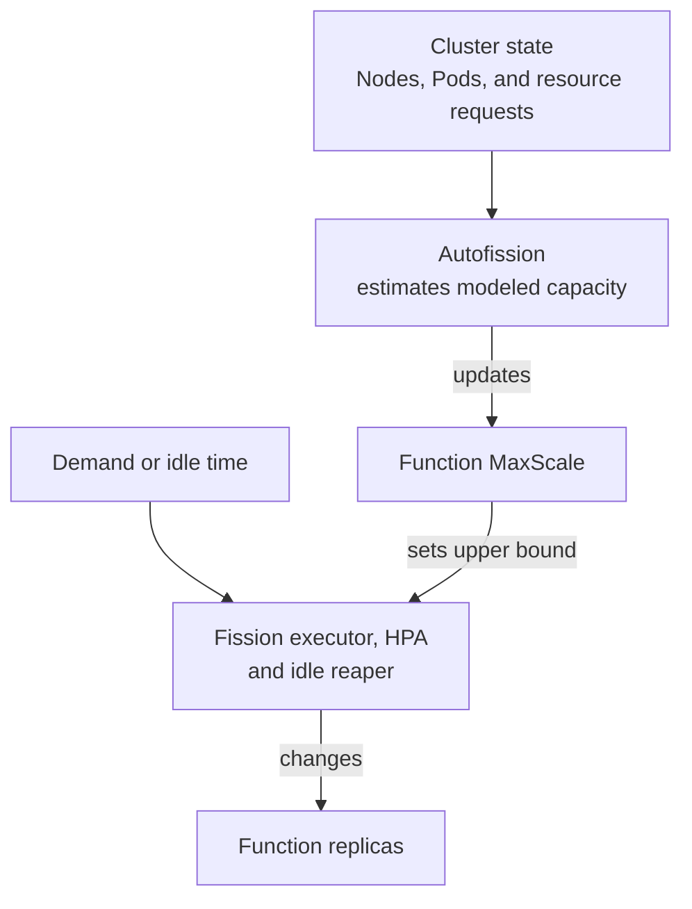

<details>
  <summary>ⓘ</summary>

[](https://pepy.tech/project/autofission)
[](https://pepy.tech/project/autofission)
[](https://coveralls.io/github/pomponchik/autofission?branch=develop)
[](https://github.com/boyter/scc/)
[](https://hitsofcode.com/github/pomponchik/autofission/view?branch=develop)
[](https://github.com/pomponchik/autofission/actions/workflows/tests_and_coverage.yml)
[](https://pypi.org/project/autofission/)
[](https://pypi.org/project/autofission/)
[](http://mypy-lang.org/)
[](https://github.com/astral-sh/ruff)
[](https://deepwiki.com/pomponchik/autofission)

</details>


Imagine a Kubernetes cluster that runs a set of services but still has unused capacity. Rather than leaving those resources idle, you could fill them with useful, elastic work that continuously adapts to whatever CPU, memory, and Pod capacity remains available.

That opportunistic workload must also yield when the cluster is needed for something else. If you deploy another service, the elastic work should make room for it instead of turning spare-capacity use into permanent resource contention.

Independent, disposable units of work are a good fit for this role: they can be packaged as AWS Lambda-like functions, and the workload can grow or shrink by changing how many function instances run at once. Managing those functions on Kubernetes requires a framework that deploys them, starts them on demand, and scales them. [Fission](https://fission.io/) provides that foundation.

Fission is excellent at deploying and scaling functions, but it is not designed to treat unused cluster capacity as a dynamic resource budget. Instead, it expects an operator to decide in advance how far each Function may scale; it does not derive that ceiling from the cluster's currently unused capacity. Set the ceiling too low and useful capacity remains idle; set it too high and Fission can ask the cluster to run more functions than it has room for.

That approach works when the capacity available to Fission is roughly constant. A shared cluster is rarely that static: services appear and disappear, new nodes join, and old nodes leave. An operator must therefore either dedicate a fixed amount of capacity to Fission and size every Function for that budget, or continually recalculate the Functions' limits as the rest of the cluster changes.

Autofission automates the second approach. It continuously estimates how much capacity remains available in the cluster and updates the scaling limit of each explicitly opted-in Function. This keeps Fission aligned with the cluster's changing spare resources without requiring manual retuning.

Autofission is designed for elastic, bare-metal, homelab, and edge clusters, where nodes come and go and idle compute should remain available to Functions without allowing them to preempt existing services.

## Table of Contents

- [**Installation**](#installation)
- [**Quick start**](#quick-start)
- [**How it works**](#how-it-works)
- [**Configuration**](#configuration)
- [**RBAC and security**](#rbac-and-security)
- [**Operations**](#operations)
- [**Development**](#development)
- [**Compatibility and limitations**](#compatibility-and-limitations)
- [**Troubleshooting**](#troubleshooting)


## Installation

Autofission is a single Python application exposed through the `autofission` CLI. It can run one reconciliation cycle and exit, or remain running and repeat the cycle at a configured interval.

Autofission can be installed in two ways:

- As a Python package for local or one-shot runs.
- As a Helm chart for continuous operation inside the cluster.

Both modes require an [existing Fission installation](https://fission.io/docs/installation/) and access to the target Kubernetes cluster.

For the Python package option, run:

```bash
pip install autofission
```

For the Helm chart option, use the OCI release below. This requires permission to create namespaced and cluster-scoped resources:

```bash
helm upgrade --install autofission \
  oci://ghcr.io/pomponchik/charts/autofission \
  --namespace fission \
  --create-namespace \
  --atomic \
  --wait
```

> ⓘ For reproducible deployments, pin a published chart version by adding `--version VERSION`.

Function Pods are opportunistic workloads and must yield cluster capacity to regular services. The Autofission Helm chart creates a PriorityClass named `autofission-runtime`. The class gives Function Pods a lower priority than ordinary Pods and prevents them from preempting other workloads. Higher-priority services can therefore reclaim their resources when necessary.

Fission creates the Function Pods, so it must be configured to assign this PriorityClass to them:

```yaml
runtimePodSpec:
  enabled: true
  podSpec:
    priorityClassName: autofission-runtime
```

CLI-only installations must provide an equivalent PriorityClass separately. See [Operations](#operations) for existing Fission workloads, [Configuration](#configuration) for credentials and resource-request settings, and [RBAC and security](#rbac-and-security) for required permissions.


## Quick start

Before opting in, ensure that the Function resolves to positive CPU and memory requests after inheritance from its Environment; otherwise, Autofission rejects that Function.

Replace `hello` and `default` below with the name and namespace of the Function you want to manage, then apply the label to opt it in:

```bash
kubectl label function hello \
  --namespace default \
  autoscaling.fission.io/cluster-capacity=true
```

This example assumes Fission's default same-namespace workload placement. If Fission sets a separate `functionNamespace`, keep the Function namespace for the Function commands and use the workload namespace for the HPA command.

For a one-shot CLI run, apply the label and then run `autofission --once`, adding `--context` or another credential-selection option when needed. For a Helm installation, wait for the controller's next successful update cycle. Then inspect the Function's `MaxScale`, the recorded calculation, and the HPA. A Helm-installed controller waits 15 seconds between cycles by default; processing and transient failures can add delay:

```bash
kubectl get function hello --namespace default \
  -o jsonpath='{.spec.InvokeStrategy.ExecutionStrategy.MaxScale}{"\n"}'
kubectl get function hello --namespace default \
  -o jsonpath='{.metadata.annotations.autoscaling\.fission\.io/calculated-maxscale}{"\n"}'
kubectl get hpa --namespace default
```

After a successful cycle, the first two values should match. The HPA may reflect the new limit slightly later because Fission updates it asynchronously.

Removing the label stops future management. Autofission deliberately does not guess or restore a previous manually configured `MaxScale`; the last calculated value and informational annotations remain until you change them.


## How it works

Autofission manages only Functions that use Fission's [`newdeploy` executor](https://fission.io/docs/usage/function/executor/). Each such Function has a fixed maximum replica count, `MaxScale`, which Fission uses as the upper bound of that Function's [Horizontal Pod Autoscaler (HPA)](https://kubernetes.io/docs/concepts/workloads/autoscaling/). Autofission changes only `MaxScale`, along with informational annotations. It does not scale replicas itself: Fission's executor, HPA, and idle reaper still decide when each Function grows and shrinks.



Given the same controller settings and Function, Environment, Node, and Pod data, each cycle produces the same result without unnecessary patches:

1. List opted-in Functions, along with Fission Environments, Kubernetes Nodes, and Pods.
2. Keep schedulable `Ready` nodes and subtract the CPU, memory, and Pod slots requested by their existing workloads. Pod requests follow Kubernetes scheduling semantics, including init containers, restartable sidecars, Pod-level requests, and Pod overhead.
3. Resolve the resources required by one replica of each Function from its Function, Environment, fetcher, and observed runtime Pod configuration.
4. For each Function independently, estimate how many total replicas fit across the remaining per-node capacity, including replicas that are already running.
5. Update `MaxScale` to the calculated capacity, but never below `MinScale` or `1`.

The controller processes each Function independently, so an invalid or conflicting Function does not block the others. However, any global or per-Function error prevents that cycle from refreshing the readiness marker. A failed cycle does not immediately invalidate the marker: the previous successful marker remains fresh until the configured maximum age expires (`60` seconds by default). The readiness probe must then fail for its configured `failureThreshold` before Kubernetes reports the Pod as `NotReady`.


## Configuration

CLI flags take precedence over valid, non-empty environment variables, which take precedence over defaults. Invalid numeric or boolean environment values fail before flags are parsed.

| CLI flag | Environment variable | Helm value | Default |
|---|---|---|---|
| `--interval-seconds` | `AUTOFISSION_INTERVAL_SECONDS` | `controller.intervalSeconds` | `15` |
| `--request-timeout-seconds` | `AUTOFISSION_REQUEST_TIMEOUT_SECONDS` | `controller.requestTimeoutSeconds` | `10` |
| `--retry-attempts` | `AUTOFISSION_RETRY_ATTEMPTS` | `controller.retryAttempts` | `3` |
| `--fetcher-cpu-request` | `AUTOFISSION_FETCHER_CPU_REQUEST` | `controller.fetcherCpuRequest` | `10m` |
| `--fetcher-memory-request` | `AUTOFISSION_FETCHER_MEMORY_REQUEST` | `controller.fetcherMemoryRequest` | `16Mi` |
| `--managed-label` | `AUTOFISSION_MANAGED_LABEL` | `controller.managedLabel` | `autoscaling.fission.io/cluster-capacity` |
| `--managed-value` | `AUTOFISSION_MANAGED_VALUE` | `controller.managedValue` | `true` |
| `--include-tainted-nodes` | `AUTOFISSION_INCLUDE_TAINTED_NODES` | `controller.includeTaintedNodes` | `false` |
| `--log-level` | `AUTOFISSION_LOG_LEVEL` | `controller.logLevel` | `INFO` |
| `--state-directory` | `AUTOFISSION_STATE_DIRECTORY` | — | `/tmp/autofission` (CLI); `/var/run/autofission` (chart) |

`--kubeconfig`, `--context`, and `--in-cluster` select credentials. `--once` runs exactly one pass. `--probe readiness|liveness --max-age-seconds N` is intended for Kubernetes exec probes.

Without credential-selection flags, the CLI uses mounted ServiceAccount credentials when `KUBERNETES_SERVICE_HOST` is non-empty; otherwise, it uses the current `kubeconfig` context. Set the fetcher request options to match the CPU and memory requests of Fission's fetcher container.


## RBAC and security

With the default RBAC values, the chart-created ClusterRole grants only these cluster-wide operations:

- `list` Nodes and Pods;
- `list` Fission Environments;
- `list` and `patch` Fission Functions.

The Python package does not install RBAC. Credentials selected for a CLI-only run must independently provide the same operations.

The chart does not grant permission to read Secrets, create or delete Functions, or mutate Pods, Nodes, Deployments, or Services. Other bindings attached to the same ServiceAccount can grant additional permissions.

In normal operation, the controller lists all Nodes, Pods, and Environments and asks the API only for label-selected Functions. It patches only opted-in Functions and changes only `MaxScale` and its calculation annotations. Kubernetes RBAC cannot enforce these restrictions: the ClusterRole authorizes listing every Function and patching any Function field. Function, Pod, and Environment specifications can contain literal environment-variable values. Node access supplies eligibility and allocatable capacity, Pod access accounts for existing workloads, and Environment access resolves inherited requests.

By default, the container runs as UID/GID `65532` with a read-only root filesystem. It drops all Linux capabilities, blocks privilege escalation, and uses a `RuntimeDefault` seccomp profile. The chart creates a NetworkPolicy with an empty ingress list; it does not restrict egress. Enforcement requires a compatible network plugin, and other NetworkPolicies can add allowed ingress because Kubernetes combines their rules.

The controller has a high, non-preempting PriorityClass, so a pending controller Pod is queued ahead of lower-priority Pods when capacity becomes available. It cannot evict running Pods, so the class does not guarantee availability after a node failure or in a full cluster. The `autofission-runtime` class defaults to priority `-10`, below the usual priority `0` of Pods without a PriorityClass. Its `preemptionPolicy: Never` prevents Function Pods from preempting other workloads, while higher-priority Pods can still preempt the Functions. Configure Fission to use this class as shown under installation. Accurate resource requests remain essential because Autofission budgets declared requests rather than measuring live CPU or memory usage.

Treat permission to set the opt-in label as permission to consume the cluster's elastic budget. In a multi-tenant cluster, restrict that label with admission policy. Restrict the high controller PriorityClass with admission policy or the linked [ResourceQuota `limitedResources` configuration plus matching namespace quotas](https://kubernetes.io/docs/concepts/policy/resource-quotas/#limit-priority-class-consumption-by-default). Autofission does not implement cross-Function quotas or fair sharing.


## Operations

The chart runs one replica with a `Recreate` strategy, preventing overlap during Deployment-managed rollouts. This rollout behavior does not guarantee a single active controller at all times because Autofission has no leader election. After a node or cluster restart, the Deployment restores its controller replica and Autofission rebuilds its state from the API.

Function patches include a `resourceVersion` precondition. If a Function changes after Autofission reads it, the patch fails with a conflict instead of overwriting the concurrent change; the daemon retries the Function during its next cycle.

Fission's `runtimePodSpec` setting is global: Fission merges its supported fields, including defaults supplied by its chart, into both `poolmgr` and `newdeploy` runtime Pods. After enabling or changing it, restart the Fission executor so it reads the new setting. Fission may not update existing `newdeploy` Deployment templates, so verify that each Function Deployment managed by Autofission uses the configured runtime PriorityClass before opting in that Function.

Useful checks for the default release name, namespace, and ServiceAccount:

```bash
kubectl rollout status deployment/autofission --namespace fission
kubectl auth can-i list pods \
  --as=system:serviceaccount:fission:autofission --all-namespaces
kubectl auth can-i patch functions.fission.io \
  --as=system:serviceaccount:fission:autofission --all-namespaces
kubectl auth can-i get secrets \
  --as=system:serviceaccount:fission:autofission --all-namespaces
```

With the default chart-managed RBAC and no additional bindings, the rollout should complete; the Pod-list and Function-patch checks should say `yes`, and the Secret check should say `no`.

Before uninstalling, remove the opt-in labels and set each Function's `MaxScale` to the limit you want to retain: stopping Autofission does not restore older values.

Uninstalling removes the controller resources but retains the runtime PriorityClass because Fission may still reference it during future cold starts. Fission CRDs, Functions, Environments, and namespaces remain untouched. Remove the PriorityClass manually only after ensuring that Fission's global `runtimePodSpec`, all Function or Environment PodSpecs, and existing Fission workload templates no longer reference it.


## Development

To install an unreleased checkout, build a controller image that the cluster can pull and install the local chart with matching image overrides:

```bash
helm upgrade --install autofission ./deploy/helm/autofission \
  --namespace fission \
  --create-namespace \
  --set-string image.repository=REGISTRY/autofission \
  --set-string image.tag=TAG
```

Apply any required controller overrides described under [Configuration](#configuration), including fetcher requests that differ from Fission's runtime settings.


## Compatibility and limitations

- Only Fission `newdeploy` Functions are managed. `poolmgr`, empty executor, and `container` are rejected as opt-in configuration errors.
- Autofission calculates the full capacity that each managed Function could use by itself. This preserves burst capacity, but simultaneous cold bursts can leave Pods `Pending`. Later cycles account for Pods from other Functions after they are scheduled and may reduce the limits; Autofission is not a fairness scheduler.
- With at least one eligible node, modeled capacity below one replica produces `MaxScale=1` because Fission and Kubernetes require a positive HPA maximum. An explicit `MinScale` is also honored even when it exceeds currently free capacity. With no eligible nodes, reconciliation fails and leaves existing limits unchanged.
- The [Fission v1 API](https://fission.io/docs/reference/crd-reference/) is tested end to end with Fission `1.27.0` on Kubernetes `1.34`; the Fission `1.27.0` chart requires Kubernetes `1.32` or newer. Other version combinations are untested. Environment resource inheritance follows Fission's override semantics and is covered by unit tests.
- Capacity includes CPU, memory, and Pod slots. It does not model storage, GPUs and other extended resources, quotas, topology or affinity, per-Function scheduling constraints, image architecture, in-place resize status, or unscheduled third-party Pods.
- Nodes with `NoSchedule` or `NoExecute` taints are excluded unless the `--include-tainted-nodes` CLI flag or `controller.includeTaintedNodes` Helm value is explicitly set. Only enable the option when Fission runtime Pods actually tolerate those taints.
- Larger requests caused by extra sidecars, Pod overhead, or runtime `Container`/`PodSpec` overrides are learned only from non-terminal Function Pods scheduled to eligible nodes. Until such a Pod exists, the Function/Environment-plus-fetcher estimate is used.
- When Fission is configured to use the low, non-preempting runtime PriorityClass shown under Installation, Function Pods cannot preempt existing workloads. This does not prevent node-pressure eviction when requests are inaccurate or nodes run at their physical limit; reserve headroom and set accurate requests.
- Very large clusters should benchmark API-server load and controller memory before shortening the default interval.
- Prefer one Autofission installation per cluster. To run multiple installations, first configure `managedLabel` and `managedValue` so the controllers select disjoint sets of Functions; two controllers must never manage the same Function. Also ensure that each release renders distinct names for its chart-created cluster-scoped resources. With the default chart settings, cluster-scoped RBAC objects and PriorityClasses use rendered full names, so identical names collide even across namespaces. Any custom cluster-scoped objects created by separate installations must also have distinct names.
- To share PriorityClasses, create and manage both classes outside Helm for as long as any installation uses them. Use a high controller value and a negative runtime value, both with `preemptionPolicy: Never`. For every release, set `priorityClasses.create=false`, point `priorityClasses.controller.name` and `priorityClasses.runtime.name` to the shared classes, and configure Fission with the shared runtime PriorityClass name.


## Troubleshooting

`Autofission is NotReady` — inspect controller logs. A `403` usually indicates missing custom RBAC or a ServiceAccount mismatch. A `409` means the Function changed after it was listed; the daemon retries it on the next cycle, while a `--once` run must be repeated. Other errors name the Function where possible.

`The calculated limit is smaller than expected` — check cordons, `Ready` status, taints, Pod requests, Pod slots, fetcher values, and per-node fragmentation. Capacity cannot combine spare CPU and spare memory located on different nodes.

`Function Pods remain Pending` — verify that one Function Pod fits on an eligible node, that `MinScale` does not exceed the calculated capacity, and that the runtime PriorityClass, taints/tolerations, node selectors, architecture, quota, storage, and concurrent managed Functions allow scheduling. Those constraints can be stricter than Autofission's current capacity model.

`The HPA has not changed yet` — Autofission patches the Function CR. Fission's executor reconciles that change into the HPA asynchronously. A successful Autofission readiness probe confirms only that a full reconciliation succeeded within the configured probe age; the controller Pod can remain `Ready` until consecutive probe failures reach `failureThreshold`.
