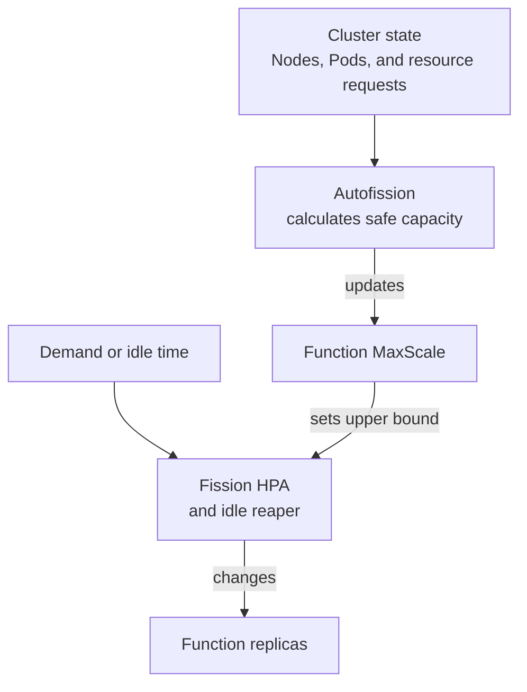

<details>
  <summary>ⓘ</summary>

[](https://github.com/pomponchik/autofission/actions/workflows/tests_and_coverage.yml)
[](https://github.com/pomponchik/autofission/actions/workflows/lint.yml)
[](https://pypi.org/project/autofission/)
[](https://pypi.org/project/autofission/)

</details>


Autofission dynamically calculates and updates the maximum replica limit (`MaxScale`) for explicitly opted-in [Fission](https://fission.io/) Functions. It derives the limit from the Kubernetes cluster's current schedulable capacity.

A Fission Function using the [`newdeploy` executor](https://fission.io/docs/usage/function/executor/) can scale down when demand disappears. Its [Horizontal Pod Autoscaler (HPA)](https://kubernetes.io/docs/concepts/workloads/autoscaling/) still needs a fixed positive `MaxScale`. A limit sized for today's cluster becomes too low when nodes are added. An arbitrarily high limit can flood the scheduler with Pods that cannot fit.

Autofission keeps the limit current by measuring schedulable capacity on each node. It subtracts the requests of existing workloads and accounts for the Function's current replicas. It is designed for elastic, bare-metal, homelab, and edge clusters where nodes come and go and idle compute should remain available to Functions without displacing ordinary services.

Autofission sets only this upper bound. Fission's HPA and idle reaper still decide when the replica count grows and shrinks.




## Table of Contents

- [**Installation**](#installation)
- [**Quick start**](#quick-start)
- [**How it works**](#how-it-works)
- [**Configuration**](#configuration)
- [**RBAC and security**](#rbac-and-security)
- [**Operations**](#operations)
- [**Compatibility and limitations**](#compatibility-and-limitations)
- [**Troubleshooting**](#troubleshooting)
- [**Development and releases**](#development-and-releases)


## Installation

Use the Python CLI for optional local or one-shot runs. Install the Helm chart to run Autofission continuously in a cluster.

### Python CLI

For local use, Autofission requires Python 3.8 or newer and is tested through Python 3.15:

```bash
python -m pip install autofission
autofission --help
```

Outside a Pod, the CLI uses the current `kubeconfig` context. Inside Kubernetes it uses the mounted ServiceAccount credentials.

To run one reconciliation without starting a daemon:

```bash
autofission --once --context my-cluster
```

This performs a real reconciliation and can update opted-in Functions.

### Install in a cluster

Prerequisites are Kubernetes and an [existing Fission installation](https://fission.io/docs/installation/). Autofission manages only Functions that use the `newdeploy` executor. The chart installs the controller, its RBAC, and two PriorityClasses; it does not install or remove Fission.

Set `AUTOFISSION_VERSION` to the chart version you want to install, then install Autofission from its OCI release:

```bash
helm upgrade --install autofission \
  oci://ghcr.io/pomponchik/charts/autofission \
  --version "${AUTOFISSION_VERSION}" \
  --namespace fission \
  --create-namespace \
  --atomic \
  --wait
```

For an unreleased checkout, replace the OCI URL with `./deploy/helm/autofission`. Autofission assumes fetcher requests of `10m` CPU and `16Mi` memory. If Fission uses different values, pass them to the chart so the capacity calculation remains accurate:

```bash
helm upgrade --install autofission ./deploy/helm/autofission \
  --namespace fission \
  --set controller.fetcherCpuRequest=20m \
  --set controller.fetcherMemoryRequest=32Mi
```

After the chart creates its PriorityClasses, configure Fission to use the [low, non-preempting runtime class](https://kubernetes.io/docs/concepts/scheduling-eviction/pod-priority-preemption/). This gives ordinary workloads precedence over elastic Function Pods. With the default Autofission release name, add the following to Fission's Helm values and upgrade Fission before opting in any Functions:

```yaml
runtimePodSpec:
  enabled: true
  podSpec:
    priorityClassName: autofission-runtime
```

## Quick start

The example uses a Function named `hello` in the `fission-function` namespace. Replace both values with your Function's name and namespace, then opt it in:

```bash
kubectl label function hello \
  --namespace fission-function \
  autoscaling.fission.io/cluster-capacity=true
```

Wait for one reconciliation interval (15 seconds by default), then inspect the Function's `MaxScale`, the recorded calculation, and the HPA:

```bash
kubectl get function hello --namespace fission-function \
  -o jsonpath='{.spec.InvokeStrategy.ExecutionStrategy.MaxScale}{"\n"}'
kubectl get function hello --namespace fission-function \
  -o jsonpath='{.metadata.annotations.autoscaling\.fission\.io/calculated-maxscale}{"\n"}'
kubectl get hpa --namespace fission-function
```

After a successful cycle, the first two values should match. The HPA may reflect the new limit slightly later because Fission updates it asynchronously.

Removing the label stops future management. Autofission deliberately does not guess or restore a previous manually configured `MaxScale`; the last calculated value and informational annotations remain until you change them.


## How it works

Each cycle is fail-safe and idempotent:

1. List opted-in Functions, along with Fission Environments, Kubernetes Nodes, and Pods.
2. Keep `Ready`, uncordoned, non-deleting nodes. Nodes with `NoSchedule` or `NoExecute` taints are excluded by default.
3. Calculate effective [CPU and memory requests](https://kubernetes.io/docs/concepts/configuration/manage-resources-containers/) for every active, scheduled Pod, including containers, init containers and sidecars, Pod-level requests, and overhead. Exclude completed and unbound Pods.
4. Resolve each Function's CPU and memory requests, inheriting missing or zero values from its Environment, then add the fetcher request. Use larger values observed on an existing Function Pod.
5. Add the Function's existing Pods back to its capacity budget because step 3 counted them as other workload. This changes only the calculation, not the Pods. Then calculate how many identical Pods fit on each node. Per-node results are summed, so CPU on one node cannot combine with memory on another.
6. Set `MaxScale` to at least `MinScale` and `1`, then patch only Functions whose value changed. A `resourceVersion` conflict prevents concurrent user edits from being overwritten.

An invalid or conflicting Function does not block the others, but the controller remains `NotReady` until every managed Function completes cleanly.


## Configuration

CLI flags take precedence over non-empty environment variables, which take precedence over defaults.

| CLI flag | Environment variable | Helm value | Default |
|---|---|---|---|
| `--interval-seconds` | `AUTOFISSION_INTERVAL_SECONDS` | `controller.intervalSeconds` | `15` |
| `--request-timeout-seconds` | `AUTOFISSION_REQUEST_TIMEOUT_SECONDS` | `controller.requestTimeoutSeconds` | `10` |
| `--retry-attempts` | `AUTOFISSION_RETRY_ATTEMPTS` | `controller.retryAttempts` | `3` |
| `--fetcher-cpu-request` | `AUTOFISSION_FETCHER_CPU_REQUEST` | `controller.fetcherCpuRequest` | `10m` |
| `--fetcher-memory-request` | `AUTOFISSION_FETCHER_MEMORY_REQUEST` | `controller.fetcherMemoryRequest` | `16Mi` |
| `--managed-label` | `AUTOFISSION_MANAGED_LABEL` | `controller.managedLabel` | `autoscaling.fission.io/cluster-capacity` |
| `--managed-value` | `AUTOFISSION_MANAGED_VALUE` | `controller.managedValue` | `true` |
| `--include-tainted-nodes` | `AUTOFISSION_INCLUDE_TAINTED_NODES` | `controller.includeTaintedNodes` | `false` |
| `--log-level` | `AUTOFISSION_LOG_LEVEL` | `controller.logLevel` | `INFO` |
| `--state-directory` | `AUTOFISSION_STATE_DIRECTORY` | — | `/tmp/autofission` (CLI); `/var/run/autofission` (chart) |

`--kubeconfig`, `--context`, and `--in-cluster` select credentials. `--once` runs exactly one pass. `--probe readiness|liveness --max-age-seconds N` is intended for Kubernetes exec probes.


## RBAC and security

The chart grants only these cluster-wide operations:

- `list` Nodes and Pods;
- `list` Fission Environments;
- `list` and `patch` Fission Functions.

It cannot read Secrets, create or delete Functions, or mutate Pods, Nodes, Deployments, or Services. Kubernetes RBAC cannot restrict `list` or `patch` permissions by label, so the opt-in label is an application-level boundary. Listing Pods exposes their specifications, including literal environment-variable values, to the controller process. This access is needed to protect capacity requested by other workloads.

The container runs as UID/GID `65532` with a read-only root filesystem. It drops all Linux capabilities, blocks privilege escalation, and uses a `RuntimeDefault` seccomp profile. The chart denies ingress but leaves egress unrestricted because a portable policy cannot select every cluster's API endpoint without hard-coded addresses.

The controller has a high PriorityClass so it remains available while Function Pods fill the cluster. The `autofission-runtime` class is negative and uses `preemptionPolicy: Never`; configure Fission to use it as shown under installation. Accurate resource requests remain essential because Autofission budgets requests like the scheduler rather than measuring live CPU or memory usage.

Treat permission to set the opt-in label as permission to consume the cluster's elastic budget. In a multi-tenant cluster, restrict that label with your admission policy. Autofission does not implement cross-Function quotas or fair sharing.


## Operations

The chart runs one replica with a `Recreate` strategy, preventing two writers from racing without requiring leader election. After a node or cluster restart, Kubernetes recreates the controller Pod and Autofission rebuilds its state from the API.

Useful checks:

```bash
kubectl rollout status deployment/autofission --namespace fission
kubectl auth can-i list pods \
  --as=system:serviceaccount:fission:autofission --all-namespaces
kubectl auth can-i patch functions.fission.io \
  --as=system:serviceaccount:fission:autofission --all-namespaces
kubectl auth can-i get secrets \
  --as=system:serviceaccount:fission:autofission --all-namespaces
```

The rollout should complete; the Pod-list and Function-patch checks should say `yes`, and the Secret check should say `no`.

Before uninstalling, remove the opt-in labels and set each Function's `MaxScale` to the limit you want to retain: stopping Autofission does not restore older values.

Uninstalling removes the controller resources but retains the runtime PriorityClass because Fission may still reference it during future cold starts. Fission CRDs, Functions, Environments, and namespaces remain untouched. Remove the PriorityClass manually only after changing Fission's `runtimePodSpec`.


## Compatibility and limitations

- Only Fission `newdeploy` Functions are managed. `poolmgr`, empty executor, and `container` are rejected as opt-in configuration errors.
- Every managed Function receives the full capacity it could use by itself. This preserves burst capacity, but simultaneous cold bursts can temporarily create `Pending` Pods. Later cycles account for scheduled peers and reduce the limits; Autofission is not a fairness scheduler.
- Fission and Kubernetes require a positive HPA maximum, so capacity below one replica produces `MaxScale=1`. An explicit `MinScale` is honored even when it exceeds currently free capacity.
- The [Fission v1 API](https://fission.io/docs/reference/crd-reference/) and Environment resource inheritance are supported and tested with Fission `1.27.0`.
- Capacity includes CPU, memory, and Pod slots. It does not model storage, GPUs and other extended resources, quotas, topology or affinity, per-Function scheduling constraints, image architecture, or unscheduled third-party Pods.
- Tainted nodes are excluded unless `--include-tainted-nodes` is explicitly set. Only enable it when Fission runtime Pods actually tolerate those taints.
- Extra sidecars and runtime `PodSpec` overhead are learned from a running Function Pod. Before the first replica, the estimate consists of the resolved runtime container plus configured fetcher requests.
- Low, non-preempting priority prevents Function Pods from evicting existing workloads. It cannot prevent node-pressure eviction when requests are inaccurate or nodes run at their physical limit; reserve headroom and set accurate requests.
- Very large clusters should benchmark API-server load and controller memory before shortening the default interval.
- Cluster-scoped RBAC and PriorityClass names use the release name, so reusing a name in another namespace causes collisions. Install Autofission once per cluster unless you set unique `fullnameOverride` and `priorityClasses.*.name` values.


## Troubleshooting

`Autofission is NotReady` — inspect controller logs. A `403` indicates custom RBAC or a ServiceAccount mismatch. A `409` means the Function changed after it was listed and will be retried safely on the next cycle. Other errors name the Function where possible.

`The calculated limit is smaller than expected` — check cordons, `Ready` status, taints, Pod requests, Pod slots, fetcher values, and per-node fragmentation. Capacity cannot combine spare CPU and spare memory located on different nodes.

`Function Pods remain Pending` — verify the runtime PriorityClass, taints/tolerations, node selectors, architecture, quota, storage, and concurrent managed Functions. Those constraints can be stricter than Autofission's current capacity model.

`The HPA has not changed yet` — Autofission patches the Function CR. Fission's executor reconciles that change into the HPA asynchronously; controller readiness only confirms the Function patch cycle.


## Development and releases

Set up a development environment and run the local checks:

```bash
python -m venv .venv
. .venv/bin/activate
python -m pip install -r requirements_dev.txt -e .
ruff check autofission tests
ruff format --check autofission tests
mypy --strict autofission
mypy tests
coverage run -m pytest -m "not e2e"
coverage report --fail-under=100
python -m build
twine check --strict dist/*
helm lint deploy/helm/autofission
```

The end-to-end suite creates a disposable Kind cluster, installs Fission, Metrics Server, and the chart, then tests scale-out, scale-in, capacity contraction, and non-preemption. Docker, Kind, kubectl, Helm, and the Fission CLI are required:

```bash
AUTOFISSION_E2E=1 pytest -m e2e -vv
```

Set `AUTOFISSION_E2E_KEEP_CLUSTER=1` when debugging to preserve the generated cluster. Set `AUTOFISSION_E2E_ARTIFACTS` to choose where failure diagnostics are written. Do not run multiple copies of this suite against the same cluster; every `pytest` session deliberately creates and owns a separate Kind cluster.

Pushes run lint, unit tests, and the end-to-end suite. A push to `main` publishes the current version to PyPI, a multi-architecture image to GHCR, and the Helm chart as an OCI artifact.
